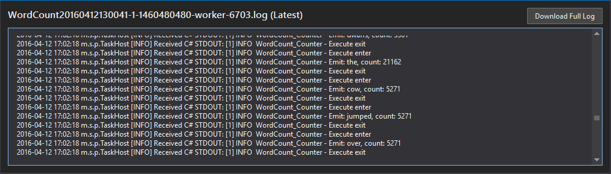

# hdinsight-dotnet-storm-wordcount
A basic example of a dotnet-based Apache Storm topology and how to run it on HDInsight. This example randomly emits a sentence, which is then broken into words. Finally, the words are counted and the word and count is emitted.

## Prerequisites

* One of the following versions of Visual Studio

    * Visual Studio 2012 with [Update 4](http://www.microsoft.com/download/details.aspx?id=39305)

    * Visual Studio 2013 with [Update 4](http://www.microsoft.com/download/details.aspx?id=44921) or [Visual Studio 2013 Community](http://go.microsoft.com/fwlink/?LinkId=517284)
    
    * Visual Studio 2015 or [Visual Studio 2015 Community](https://go.microsoft.com/fwlink/?linkid=532606&clcid=0x409)

* Azure SDK 2.5.1 or later

* HDInsight Tools for Visual Studio: See [Get started using HDInsight Tools for Visual Studio](https://azure.microsoft.com/documentation/articles/hdinsight-hadoop-visual-studio-tools-get-started/) to install and configure the HDInsight tools for Visual Studio.

## SCP.NET package version

The SCP.NET package version that you use for this project depends on the version of Storm installed on your HDInsight cluster. Use the following table to determine what SCP.NET version you must use in your project:

| HDInsight version | Apache Storm version | SCP.NET version |
|:-----------------:|:--------------------:|:---------------:|
| 3.3 | 0.10.# | 0.10.#.# |
| 3.4 | 0.10.# | 0.10.#.# |
| 3.5 | 1.0.# | 1.0.#.# |

## About the code

This example Storm topology is implemented using the following components:

* Spout.cs - This component emits one of five sentences to the output stream when it is called by the topology.

* Splitter.cs - This component reads the sentences emitted by the spout and splits it into individual words. Each word is then emitted to the output stream.

* Counter.cs - This component reads the words emitted by the splitter component and keeps a count of how many times a word has occurred.

* Program.cs - This defines the topology, which describes how the data flows between the components, how many instances of each component to create, and other configuration information for the topology.

The following is a visual representation of the data flow between the components.

## Deploy this sample to Azure

1. Once you have downloaded this project, open it using Visual Studio.

2. In __Solution Explorer__, right click the __WordCount__ project and then select __Build__. This should download any required dependencies and build the project.

    

3. In __Solution Explorer__, right click the __WordCount__ project and then select __Submit to Storm on HDInsight__. If prompted, authenticate to your Azure subscription.

    

4. In the __Submit Topology__ dialog, select your cluster using the __Storm Cluster__ dropdown list. Leave the other fields at the default values, and then select __Submit__.

    

    > Note: It may take a few seconds to populate the list of Storm Clusters.

5. Once the topology has been submitted, the __Topology View__ will open. This displays the currently deployed topologies for the Storm cluster. Select the __WordCount__ entry to display information about the topology.

    
    
6. Double click the __Counter__ entry. This will display information for the Counter bolt.

    
    
7. From the __Executors__ section, select the __Port__. This will display a log of information emitted by this bolt.

    
    
    You can see the information logs, including the emitted tuples that contain information about the number of times a word has occurred.

8. To stop the topology, return to the __Topology View__, select the topology, and then select the __Kill__ button above the topology information.

    

## More information

For more information on working with C# topologies and Storm on HDInsight, see [Develop C# topologies for Apache Storm on HDInsight using HDInsight tools for Visual Studio](https://azure.microsoft.com/documentation/articles/hdinsight-storm-develop-csharp-visual-studio-topology/).

## Project code of conduct

This project has adopted the [Microsoft Open Source Code of Conduct](https://opensource.microsoft.com/codeofconduct/). For more information see the [Code of Conduct FAQ](https://opensource.microsoft.com/codeofconduct/faq/) or contact [opencode@microsoft.com](mailto:opencode@microsoft.com) with any additional questions or comments.